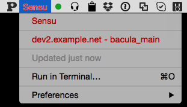

What?
=====

A plugin for BitBar to show Sensu events



Setup?
------

Install [BitBar](https://github.com/matryer/bitbar) and copy the ```sensu.1m.rb``` file to the directory
you choose as your plugin directory.

You can monitor multiple Sensu installs by just copying the file to a new name, the frequency of updates
can be set by changing ```1m``` to ```5m``` in the file name.  See the BitBar docs for more options

Edit the contants at the top of each script to your taste:

```ruby
SENSU_NAME="Sensu"                                  # text appearing on the menu in green/red/yello
SENSU_HOST="http://sensu.example.net:4567/"         # your sensu api
DASHBOARD_URL="http://uchiwa.example.net/#/events"  # a link that will open if you click on an event
PROXY="http://10.1.4.1"                             # set to nil to avoid using a proxy
SHOW_EVENTS=5                                       # how many events to show in the drop down
```

And enjoy

Contact?
========

R.I.Pienaar / rip@devco.net / @ripienaar / http://devco.net/
